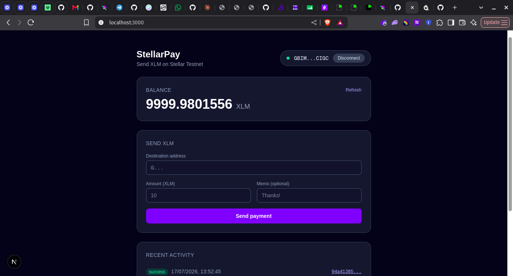
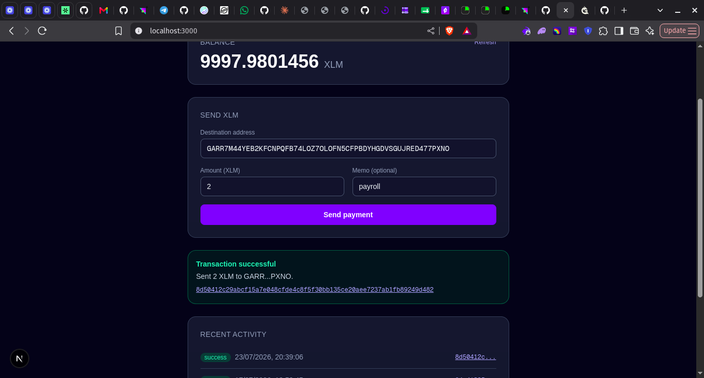

# StellarPay

A simple Stellar Testnet payment dApp built with Next.js, TypeScript, and Tailwind CSS. Connect your Freighter wallet, view your XLM balance, and send testnet XLM payments — with clear success/failure feedback and a recent activity feed.

Built for **Level 1 – White Belt** of the Stellar frontend challenge.

## Features

- **Wallet connect / disconnect** via the [Freighter](https://www.freighter.app/) browser extension
- **Network check** — verifies Freighter is set to Stellar Testnet before allowing any action
- **Balance display** — fetches and shows the connected account's XLM balance from Horizon Testnet
- **Friendbot funding** — one-click testnet funding if the connected account doesn't exist yet
- **Send XLM** — build, sign (via Freighter), and submit a native XLM payment with an optional memo
- **Transaction feedback** — success/failure banner with the transaction hash linked to [Stellar Expert](https://stellar.expert/explorer/testnet)
- **Recent activity** — lists the connected account's most recent transactions with links to the explorer

## Tech stack

- [Next.js](https://nextjs.org) (App Router) + TypeScript
- Tailwind CSS
- [`@stellar/stellar-sdk`](https://www.npmjs.com/package/@stellar/stellar-sdk) for building/submitting transactions and querying Horizon
- [`@stellar/freighter-api`](https://www.npmjs.com/package/@stellar/freighter-api) for wallet connection and transaction signing

## Prerequisites

- [Node.js](https://nodejs.org/) 18+
- The [Freighter](https://www.freighter.app/) browser extension, installed and set to **Test Net** (Freighter settings → Preferences → Network)
- A funded Freighter testnet account (the app can fund a new one for you via Friendbot)

## Setup instructions

1. Clone the repository and install dependencies:

   ```bash
   git clone https://github.com/devsimze/StellarPay
   cd stellar-payment-dapp
   npm install
   ```

2. Run the development server:

   ```bash
   npm run dev
   ```

3. Open [http://localhost:3000](http://localhost:3000) in your browser.

4. Make sure the Freighter extension is installed and switched to **Test Net**, then click **Connect Freighter**.

## How to use it

1. Click **Connect Freighter** and approve the connection request in the extension popup.
2. If the account has no balance yet, click **Fund with Friendbot** to receive 10,000 testnet XLM.
3. Enter a destination public key (`G...`), an amount, and an optional memo, then click **Send payment**.
4. Approve the transaction signature request in Freighter.
5. The result banner shows whether the payment succeeded or failed, along with the transaction hash (linked to Stellar Expert). The recent activity list refreshes automatically.

## Project structure

```
app/page.tsx           # Main page — wires wallet, balance, send, and history state together
components/            # WalletConnect, BalanceCard, SendForm, TxResult, TxHistory
lib/freighter.ts       # Freighter wallet connect/sign helpers + testnet network check
lib/stellar.ts         # Horizon Testnet queries + payment transaction building/submission
```

## Screenshots

**Wallet connected + balance displayed**



**Successful testnet transaction + result shown to the user**



Live example transaction on Stellar Testnet: [8d50412c...9249d482](https://stellar.expert/explorer/testnet/tx/8d50412c29abcf15a7e048cfde4c8f5f30bb135ce20aee7237ab1fb89249d482)

## Notes

- This app only targets **Stellar Testnet** (`Networks.TESTNET`) — it will refuse to proceed if Freighter is set to any other network.
- "Disconnect" clears the app's local wallet state; Freighter itself manages which sites it's connected to (there's no on-chain or extension-level "disconnect" action to call).
